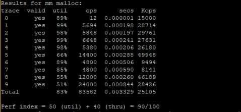

# Dynamic memory allocator

 Copyright (c) 2002, R. Bryant and D. O'Hallaron, All rights reserved.
 May not be used, modified, or copied without permission.

## Solution (mm.c) - Segregated free list 

- Free blocks are stored as linked list
- 12 lists for storing block list of same size (interval=128)
	 - For instance:
	 	- the first list contains blocks within size 0 to 128
	 	- the second list contains blocks within size 129 to 256 and so on
		
- A Block will be deleted after allocated, a new block will be created with the remaining memory

- Insertion and deletion having time complexity O(1) to maintain a high throughput
	- Insertion: Released blocks will be set as the second element.
	- Deletion: Link it's child pointer as its' parent's next 

- Searching (first-fit allocation)
	- O(1) in best case

- In practical, aims for O(1) in best case provided a better result than trees structure.  
 
## Result



## Project Details 
```
***********
Main Files:
***********

mm.{c,h}
	Your solution malloc package. mm.c is the file that you
	will be handing in, and is the only file you should modify.

mdriver.c
	The malloc driver that tests your mm.c file.

traces/
	This directory contains traces to evaluate your malloc packages.
	short{1,2}-bal.rep are two tiny traces that you can use for debugging.g

traces/plot/
	This directory contains plots of allocated memory over time for traces.

Makefile
	Builds the driver

**********************************
Other support files for the driver
**********************************

config.h	Configures the malloc project driver
fsecs.{c,h}	Wrapper function for the timer function based on gettimeofday()
memlib.{c,h}	Models the heap and sbrk function

*******************************
Building and running the driver
*******************************
To build the driver, type "make" to the shell.

To run the driver on a tiny test trace:

	$ ./mdriver -V -f traces/short1-bal.rep

The -V option prints out helpful tracing and summary information.

To get a list of the driver flags:

	$ ./mdriver -h

```
